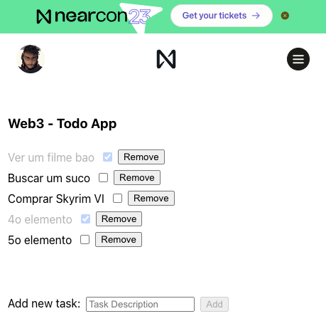

## Todo dApp - Tutorial

A simple dApp where you can view the last stored greeting and send a new greeting message. This was built using [**BOS**](https://near.org/), [**Near Social Bridge**](https://github.com/wpdas/near-social-bridge) and [**Thirdweb**](https://thirdweb.com/).

This dApp is live here: https://near.org/wendersonpires.near/widget/SimpleTodoApp

### How to test locally

- Clone this repo;
- Run `yarn install`;
- Then, run `yarn start` to test it locally;

You'll be presented with a list of Widgets, click on `TodoApp` to see the app in action.

### How to deploy it

Follow this guide to get to know how to deploy it to BOS using Thirdweb.

### Complete Tutorial

You can read the tutorial to build this app and deploy it [**here**](./TUTORIAL.md).

## Demo Image

  

