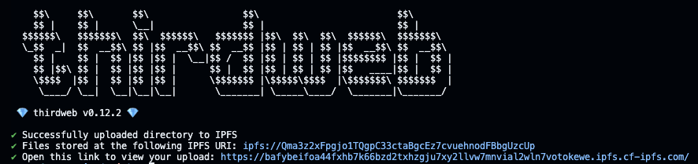
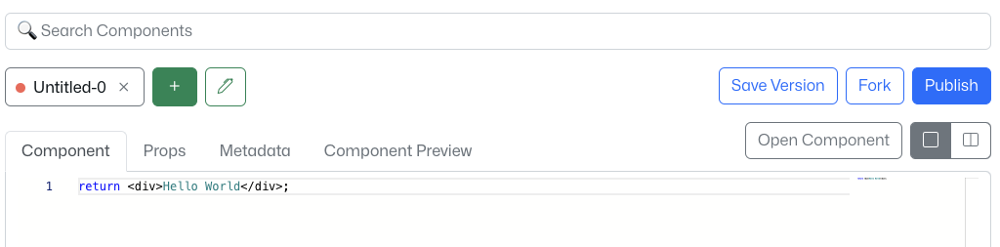

# dApp with Near BOS, Near Social Bridge & Thirdweb

In this tutorial, I'm going to teach you how to create a dApp using regular ReactJS app plus [Near Social Bridge](https://github.com/wpdas/near-social-bridge), which is a library that connects your app with [BOS](https://near.org/). You are expected to have some experience with the Blockchain Operating System (BOS) and React.

Be aware that you can create your app within BOS using BOS components without using any of these additional things I'm putting in this tutorial. You can get to know more here: https://docs.near.org/bos/overview#.

So what is this tutorial for? This tutorial is for those who want to create regular React applications and connect them to BOS taking advantage of all the features of BOS.

## Prerequisites

In order to make this project possible, you'd need a few things:

1 - MetaMask wallet with some account <br>
1.1 - You can skip this if you wanna use Vercel to deploy your React App, but it'll be **centralized**.

2 - Install MetaMask for your browser: https://metamask.io/download/ <br>
2.1 - You can skip this if you wanna use Vercel to deploy your React App, but it'll be **centralized**.

3 - [Thirdweb](https://thirdweb.com/) API Key. This will help us upload our files to IPFS and pin the file, so that, it doesn't get deleted when the IPFS runs the garbage collector. You'll have up to 50GB of storage pinning using the STARTER (free) plan, which is pretty enough. <br>
3.1 - You can skip this if you wanna use Vercel to deploy your React App, but it'll be **centralized**.

4 - [Near account](https://near.org/). This is necessary because here is where you can create your components and make them available to the entire world.

5 - It's worth taking a look at the [Near Social Bridge docs](https://github.com/wpdas/near-social-bridge#-near-social-bridge).

## Project Bootstrap

We're going to create a Todo app.

1 - Start the project with React, Near Social Bridge & Near Social Local Viewer

```sh
yarn create react-app my-dapp --template typescript
```

After that, go to the project's folder:

```sh
cd my-dapp
```

2 - Install Near Social Bridge + Near Social Local Viewer

```sh
yarn add near-social-bridge; yarn add near-social-local-viewer -D
```

3 - Replace the `start` script to run the app within BOS Vm and add a new script called `vm:start` . It'll allow you to test your app using the BOS resources.

```json
"scripts": {
    "start": "(BROWSER=none react-scripts start) & yarn vm:start",
    "vm:start": "npx init-viewer bos",
}
```

The `vm:start` script has two things that you may want to be aware: `bos` is the folder (from root) where the BOS Components will locally be.

4 - Create a `bos` folder in the project's root then, create a new BOS Component (your BOS app) file for `development`:

```jsx
// bos/TodoApp.jsx
const externalAppUrl = 'http://localhost:3000'

return <Widget src={'wendersonpires.near/widget/NearSocialBridgeCore'} props={{ externalAppUrl }} />
```

5 - At this point, we're almost ready to start developing our app, run this command to start the development process: `yarn start`. A new browser tab will be open. Click on the Component you want to execute. In this case **TodoApp**.

It'll take some time to render the app as it isn't connected to BOS still. Let's fix it. Go to the `src/index.tsx` file and wrap up the `<App>` with `<NearSocialBridgeProvider>` like so:

```tsx
// src/index.tsx
import ReactDOM from 'react-dom/client'
import './index.css'
import App from './App'
import { NearSocialBridgeProvider } from 'near-social-bridge'

const root = ReactDOM.createRoot(document.getElementById('root') as HTMLElement)
root.render(
  <NearSocialBridgeProvider>
    <App />
  </NearSocialBridgeProvider>
)
```

## Building

1 - Firstly, let's create the service files which are going to be used inside our app.

We need to create a service to fetch the stored tasks, so, create the `services/getTasks.ts` file with the following content:

```tsx
// src/services/getTasks.ts
import { Social } from 'near-social-bridge/api'

export interface Task {
  id: number
  finished: boolean
  description: string
}

type TasksIndex = {
  value: Task[]
}[]

// get the user tasks
const getTasks = async (accountId: string) => {
  const response = await Social.index<TasksIndex>(`todo-app-${accountId}`, 'tasks', {
    limit: 1, // Always the most recent
    order: 'desc',
  })

  if (Array.isArray(response) && response[0]) {
    return response[0].value
  }

  return []
}

export default getTasks
```

Now, create another file to persist the task's changes `services/storeTasks.ts` :

```tsx
// src/services/storeTasks.ts
import { Social } from 'near-social-bridge/api'
import { Task } from './getTasks'

// save tasks state
const storeTasks = (updatedTasks: Task[], accountId: string) =>
  Social.set<{ error?: string }>({
    index: {
      [`todo-app-${accountId}`]: JSON.stringify({
        key: 'tasks',
        value: updatedTasks,
      }),
    },
  })

export default storeTasks
```

2 - Creating the React Components

Create the `components/NewTodoForm.tsx` file with the following content:

```tsx
// src/components/NewTodoForm.tsx
type Props = {
  taskDescription: string
  onInputChange: (inputValue: string) => void
  onAddClick: () => void
}

const NewTodoForm: React.FC<Props> = ({ taskDescription, onInputChange, onAddClick }) => (
  <div style={{ marginTop: '52px' }}>
    <label style={{ marginRight: '8px' }}>Add new task:</label>
    <input
      style={{ marginRight: '8px' }}
      placeholder="Task Description"
      value={taskDescription}
      onChange={(e) => onInputChange(e.target.value)}
    />
    <button disabled={!taskDescription} onClick={onAddClick}>
      Add
    </button>
  </div>
)

export default NewTodoForm
```

Create the `components/NotLoggedInWarning.tsx` component:

```tsx
// src/components/NotLoggedInWarning.tsx
const NotLoggedInWarning = () => <p> Sign In to view your todo list </p>

export default NotLoggedInWarning
```

Create the `components/TaskItem.tsx` component:

```tsx
// src/components/TaskItem
import { Task } from '../services/getTasks'

type Props = {
  task: Task
  completeTaskHandler: (task: Task) => void
  removeTaskHandler: (task: Task) => void
}

const TaskItem: React.FC<Props> = ({ task, completeTaskHandler, removeTaskHandler }) => {
  return (
    <div
      style={{
        display: 'flex',
        alignItems: 'center',
        marginTop: '8px',
      }}
    >
      <p
        style={{
          margin: '0 8px 0 0',
          opacity: task.finished ? '0.3' : '1',
        }}
      >
        {task.description}
      </p>
      <input
        style={{
          marginRight: '8px',
          opacity: task.finished ? '0.3' : '1',
        }}
        type="checkbox"
        checked={task.finished}
        onChange={() => completeTaskHandler(task)}
      />
      <button onClick={() => removeTaskHandler(task)}>Remove</button>
    </div>
  )
}

export default TaskItem
```

And finally, create the `components/TodoList.tsx` component. This component is going to handle the todo list functionality:

```tsx
// src/components/TodoList.tsx
import { useCallback, useEffect, useState } from 'react'
import { useAuth } from 'near-social-bridge/auth'
import NewTodoForm from './NewTodoForm'
import TaskItem from './TaskItem'
import getTasks, { Task } from '../services/getTasks'
import storeTasks from '../services/storeTasks'

const TodoList = () => {
  const [status, setStatus] = useState<'ready' | 'loading' | 'saving'>('loading')
  const [taskDescription, setTaskDescription] = useState('')
  const [tasks, setTasks] = useState<Task[]>([])
  const auth = useAuth()

  // Fetch previous tasks
  useEffect(() => {
    if (auth.ready) {
      getTasks(auth.user?.accountId!).then((tasks) => {
        setTasks(tasks)
        setStatus('ready')
      })
    }
  }, [auth])

  const persistUpdatedData = useCallback(
    async (tasksList?: Task[]) => {
      const updatedTasks = tasksList
        ? tasksList
        : [...tasks, { id: Date.now(), description: taskDescription, finished: false }]
      setStatus('saving')
      // Persist data
      const result = await storeTasks(updatedTasks, auth.user?.accountId!)
      if (!result.error) {
        setTasks(updatedTasks)
      }
      setTaskDescription('')
      setStatus('ready')
    },
    [taskDescription, tasks, auth]
  )

  const completeTaskHandler = (task: Task) => {
    const updatedTasks = tasks.map((taskItem) => {
      if (taskItem.id === task.id) {
        taskItem.finished = !taskItem.finished
      }
      return taskItem
    })

    // Persist updated data
    persistUpdatedData(updatedTasks)
  }

  const removeTaskHandler = (task: Task) => {
    const updatedTasks = tasks.filter((taskItem) => taskItem.id !== task.id)
    // Persist updated data
    persistUpdatedData(updatedTasks)
  }

  return (
    <div style={{ display: 'flex', justifyContent: 'center', flexDirection: 'column' }}>
      {tasks.length === 0 && status === 'ready' && <p>No Tasks yet!</p>}
      {status !== 'ready' ? (
        <p>{status}...</p>
      ) : (
        <>
          {tasks.map((task) => (
            <TaskItem
              key={task.id}
              task={task}
              completeTaskHandler={completeTaskHandler}
              removeTaskHandler={removeTaskHandler}
            />
          ))}
          <br />
          <NewTodoForm
            taskDescription={taskDescription}
            onInputChange={(inputValue) => setTaskDescription(inputValue)}
            onAddClick={() => persistUpdatedData()}
          />
        </>
      )}
    </div>
  )
}

export default TodoList
```

Change the `App.tsx` file to load the stuff we've just created:

```tsx
// src/App.tsx
import { useAuth } from 'near-social-bridge'
import TodoList from './components/TodoList'
import NotLoggedInWarning from './components/NotLoggedInWarning'

function App() {
  const auth = useAuth()

  return (
    <div className="App">
      <h3>Web3 - Todo App</h3>

      {auth.user ? <TodoList /> : <NotLoggedInWarning />}
    </div>
  )
}

export default App
```

Well done, so far so good! You can save the files now and see the app working. Create new tasks, mark them as done or remove them. All the actions are going to be persisted on chain.

## Deploying

We have our app ready to be deployed, but how can we deploy it in a decentralized way?! Hold on, let's start this process now.

1 - First of all, we need to build our app:

```sh
yarn build
```

At this point, you should have the generated final files inside the build folder.

2 - Create a MetaMask wallet if you don't have one yet and create an account (e.g. Ethereum).

3 - If you have a Thirdweb API Key in place at this point, you can skip it. If not: <br>
3.1 - Go to https://thirdweb.com/dashboard, then click on **Connect Wallet**. Select **MetaMask**, it'll open up the MetaMask extension. All you need to do is proceed, agreeing with all the steps. <br>
3.2 - Now, go to the **Settings** tab, then, on the left side, **API Keys**, then, **+ Create API Key**. <br>
3.3 - Follow the modal steps to create your API Key. When you reach the **Set Access Restrictions** step, mark the **Unrestricted access** checkbox or type the domains you want to allow: `localhost:3000, localhost:3001, near.org, alpha.near.org, test.near.org`. At the end of the process, you will receive a client ID and secret key. Copy and paste this data somewhere else, you may need them for other projects.

4 - In your terminal (from the the root), type:

```sh
npx thirdweb@latest upload build
```

This command is used to upload a folder and its files to IPFS and pin them. If this is your first time on your machine using thirdweb, it's going to open up a tab in your browser asking to authorize your machine.

In case your machine is authorized already, it'll just upload the files.

You'll be provided with the IPFS URI and also a link to access your files using the Thirdweb gateway, this is the one we're going to use inside the BOS. Copy and paste it somewhere, we'll use it later.

<p align="left">
  
</p>

This provided link is going to open the index.html because this is the pattern, but you can navigate through every file like so: https://bafybeifoa44fxhb7k66bzd2txhzgju7xy2llvw7mnvial2wln7votokewe.ipfs.cf-ipfs.com/logo192.png

Every time you upload a file or folder, they are going to have a unique CID as well as a unique link.

5 - Now, we need to go to [**near.org**](https://near.org), Sign In and create our BOS component there. To do so, after signing in, go to https://near.org/sandbox.

6 - Once there, click on **Create New Component**.

7 - You will see something like this:

<p align="left">
  
</p>

Click on the **pencil** icon to rename the current component. You can insert whatever name you want. For this example, I'm using SimpleTodoApp.

8 - Now, let's, copy and paste the content below inside your new Component:

```jsx
// The link provided by Thirdweb pointing to the react app stored inside IPFS
const externalAppUrl = 'https://bafybeifoa44fxhb7k66bzd2txhzgju7xy2llvw7mnvial2wln7votokewe.ipfs.cf-ipfs.com/'

return (
  <Widget
    src={'wendersonpires.near/widget/NearSocialBridgeCore'}
    props={{
      externalAppUrl,
    }}
  />
)
```

The `externalAppUrl` is exactly what it says, it's the link to access your React app. The `<Widget>` is a built-in component used to include an existing BOS component in your code. You can learn more about it here: https://docs.near.org/bos/components/widgets.

Okay, once the BOS Component is ready, click on **Publish**. You'll be asked to save the data, click on **Save Data**.

9 - At this point, your dApp is live to the entire world. You can click **Open Component** to see your app working and also get its URL.

Its URL should be something like this: https://near.org/wendersonpires.near/widget/SimpleTodoApp. Of course, this is the link to the app I built while writing this tutorial.

10 - Finally, this is just a tip: Every time you want to update your BOS Component, you can do it and then Publish it again and again.

That's it guys. I hope you enjoy creating this dApp and reach me out in case you need help :D.
