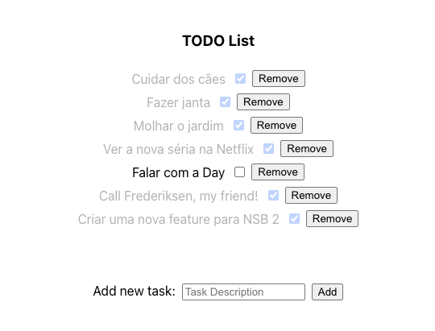

# Greeting App

A simple app where you can view the last stored greeting and send a new greeting message.

## How to run

Install dependencies:

```sh
npm install
```

Run the application inside the local viewer

```sh
npm run start
```

You'll be presented with a list of Widgets, click on `TodoApp` to see the app in action.

<p align="center">
  
</p>
