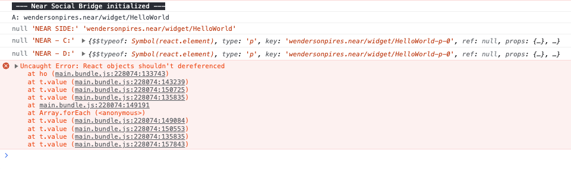
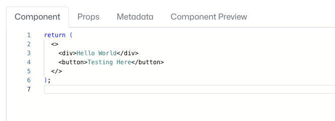
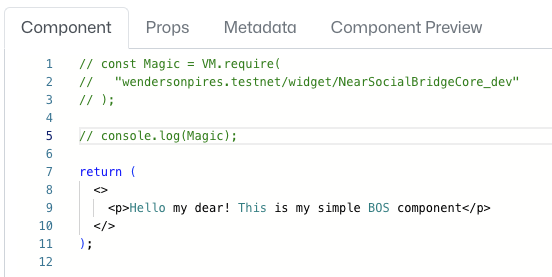
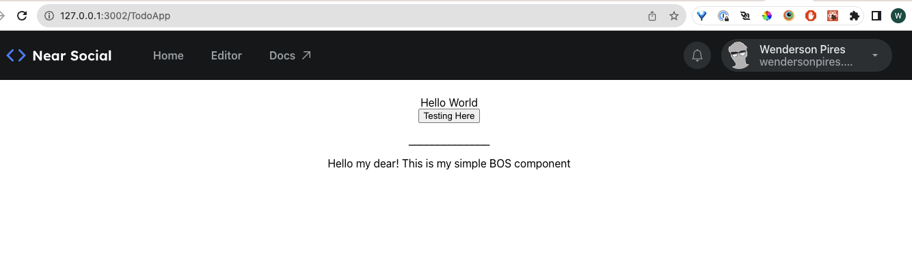
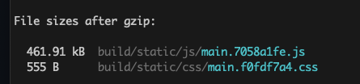

# useLazyBOS

The purpose of this hook is to load components from within the BOS and inject them into the React application.

## The problems

**Using VM:**

Unfortunately it is not possible to embed a Widget inside a React application. This happens because the VM.require support only modules that doesn't use State. I can only import simple components (stateless) into React App. (The behavior is same when you try to use it within a BOS Component)

**Using `VM.require` on BOS side:**

There's a way to fetch the JSX info using a Widget, but there's a lock to prevent this code from being passed on. https://github.com/NearSocial/VM/blob/master/src/lib/vm/vm.js#L289

```jsx
const HelloWorld = VM.require('wendersonpires.testnet/widget/HelloWorld')
const stringifiedComponent = JSON.stringify(HelloWorld) // The idea was to send this data to the React App and parse it there.
// throws the error below:
```

<p align="left">
  
</p>

## Using VM

This is the only way found out till now.You can find the files on this directory.

You may need to install the needed dependencies required by the `useLazyBOS.tsx`, `vm/vm.js` and `vm/utils.js` files.

**1** - Usage:

```tsx
import useLazyBOS from './useLazyBOS'

function App() {
  const HelloWorld = useLazyBOS('wendersonpires.testnet/widget/HelloWorld')
  const NSBCore = useLazyBOS('wendersonpires.testnet/widget/TestEverything')

  return (
    <div className="App">
      <HelloWorld />
      <br />
      <NSBCore />
    </div>
  )
}
```

**2** - HelloWorld (BOS Component/Widget):

<p align="left">
  
</p>

**3** - TestEverything (BOS Component/Widget):

<p align="left">
  
</p>

**4** - The result:

<p align="left">
  
</p>

**5** - The (terrible) final bundle size. This is a huge problem for this implementation because it's using VM to parse the component to JSX:

<p align="left">
  
</p>
